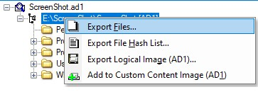
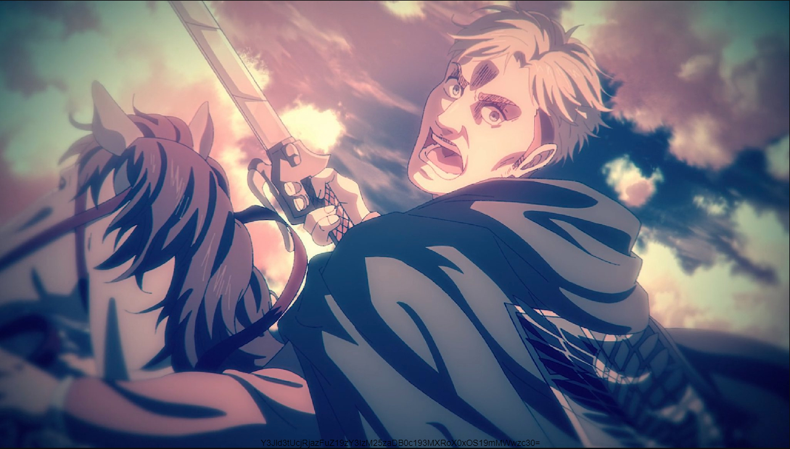
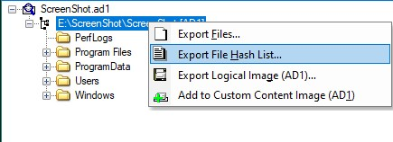

# Screenshot

We are given a .ad1 File and we need to find several things inside.

## Pt. 1

The first challenge is to find the name of the secret file. The description hints that we might need to find an image.
To get a better overview of the files, I extracted the .ad1 image with FTK Imager.
<br/><br/>
Now that we have got the files, we can start searching for the screenshot. As Windows somehow did not find all the files, I used Linux to do this job.<br/>
With the use of 
<br/>`find . -name '*' -exec file {} \; | grep -o -P '^.+: \w+ image' `
<br/>I filtered all the files for any kind of image file and finally found the screenshot inside of the ScreenSketch Folder, which is a tool that comes with Windows, specifically the `TempState` Folder (`AppData\Local\Packages\Microsoft.ScreenSketch_8wekyb3d8bbwe\TempState`).<br/>The filename is `19422F1B-6C19-4190-9674-0D1C5AEC5451.png`<br/>

## Pt. 2

In this part, we need to find the MD5 hash of the associated LNK File... I attempted to create it myself but realized that there is information inside LNK files, that we cannot know.<br/>I was on the verge of giving up and thought that maybe not all of the files got exported... I used FTK Imager once again to export a list of all files as inside the image as .csv:
<br/><br/>
Works!
With the help of `STRG+F` I searched for "ScreenSketch" and there were actually some weirdly named lnk files inside!
```csv
ef6024630ca7a7601a83ecb5af634ce6,"d66260224de3d30616b765dcaddbb6c803b8e8ec","ScreenShot.ad1\E:\ScreenShot\ScreenShot [AD1]\Users\0xSh3rl0ck\AppData\Roaming\Microsoft\Windows\Recent\ms-screensketcheditisTemporary=true&source=screenclip&sharedAccessToken=0CFD1BEB-8309-414C-80D1-8F7D1132DA56&secondarySharedAccessToken=0557B721-9B6F-4EED-8FCC-0523E30625B5&viewId=-198227.lnk"
```
It even includes the MD5 hash of that files. Challenge solved.

## Pt. 3

For the last challenge, we need to find a `secret text`. I instantly knew the solution as I took a closer look at the screenshot! <br/>As we can see, there is a base64 encoded string at the bottom of the image: 
`Y3Jld3tUcjRjazFuZ19zY3IzM25zaDB0c193MXRoX0xOS19mMWwzc30=`<br/>
which translates to: `crew{Tr4ck1ng_scr33nsh0ts_w1th_LNK_f1l3s}`<br/>
I first thought that that might be a decoy flag but it actually worked for the last part!